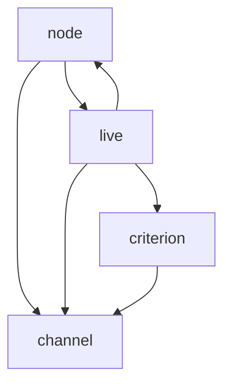

# stmgr

live **st**ream **m**ana**g**e**r**

## modules

### module list

- domain
    - channel
    - live
    - node
    - criterion
- external
    - infra
    - platform
- job
    - task
- common
    - utils
    - common

### domain module dependency

